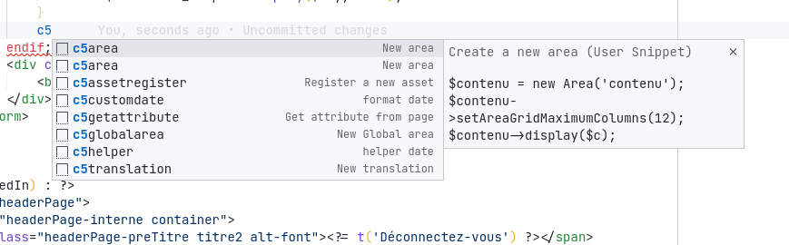

# concrete5-snippets

_Finally, Concrete5 snippets for VSCode!_

This extension adds a number of concrete5 snippets to VSCode. The snippets all start with **c5** and work as soon as VSCode detects that the language used is HTML or PHP.

It is also possible to generate single page and page type controllers by right clicking on the folders `public/application/controllers/single_page` and `public/application/controllers/page_types`.

## Snippets

| lang         | identifier        | description                    |
| ------------ | ----------------- | ------------------------------ |
| `html` `php` | `c5area`          | Create a new area              |
| `html` `php` | `c5globalarea`    | Create a new global area       |
| `html` `php` | `c5translation`   | Create a new translation       |
| `html` `php` | `c5getattribute`  | Get a page attribute           |
| `php`        | `c5helper`        | Use a helper                   |
| `php`        | `c5customdate`    | Format a date                  |
| `php`        | `c5assetregister` | Register a new CSS or JS asset |
| `html`       | `c5locale`        | Get the current locale         |
| `html`       | `c5include`       | Include a file                 |
| `html`       | `c5theme`         | Get the theme path             |
